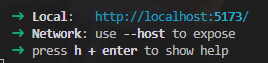

# Tech Stack
- 'client_html' will be utilizing HTML/TailwindCSS
- 'client_react' will be utilizing ReactJS TypeScript, a framework for frontend.

# Directory 
- 'client_html' will contain the vanilla-HTML files for the frontend.

- 'client_react' will contain the ReactJS version of the frontend, it will use the HTML structure from the client_html but with extras function and system.

# How To Develop 'client_react' in Local Development.
1. Ensure you have 'Bun Shell' installed, you can install it via https://bun.sh/. Make sure you select the right OS you're planning to install in. 

Note: If you have Bun installed, you'll see the version by typing this in your CMD/PowerShell/GitBash/
```
bun --version
```

2. Once you have Bun installed, git clone this repository into your local device.
```
https://github.com/Yion05/swsg.git
```

3. As the repository has been successfully git cloned, navigate to this directory 'client_react' and once you're inside the directory of it, initial the packages/modules with this command in terminal.
```
bun i
```

4. Once initialized, you can now run the frontend by the following command in terminal.
```
bun dev
```

5. After initialized, you'll see the site is being hosted using your device local IP (localhost) in the default Vite port which is 5173. (Note, if another server is also using 5173, it'll increment by 1 which will be 5174 and so on.). Head to the assigned local port and you'll see the result http://localhost:5173/.


Note: If you have encounter any issue with this step, please issue to me(skx1322). Thank you for reading.

# 'client_react' directory

| Directory/Folder/Files  | Description |
| ------------- | ------------- |
| src  | The main source directory where all the components and function are located in. |
| public  | The public source directory where assets is located in, it is deeply tie with the src's components. IMPORTANT: It also contain 'locales' which will contain the translation files for text. |
| node_modules | ReactJS/Bun's package and modules files are stored in here, it is heavy and will be appeared when you do the bun install |
| package.json  | The default config for the package and modules, it also contain script to start the Vite hosting |
| Dockerfile  | Dockerfile for deployment |
| .env  | You can initial an .env file if you want to put a secret-key or backend's URL. |
| nginx.conf | Router system for deployment method |


